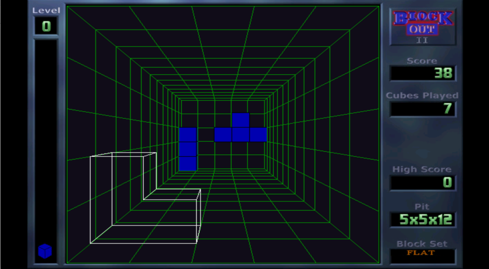

#BlockOut II for Nintendo Wii

This is a Nintendo Wii port of BlockOut II game by Jean-Luc PONS (http://www.blockout.net/blockout2)

Nintendo Wii port: Bomblik

BlockOut II is reimplementation of original 1989 puzzle video game, developed in Poland by
Aleksander Ustaszewski and Mirosław Zabłocki and published by California Dreams for multiple
platforms. Original BlockOut was the first video game which transfered tetris from 2D into 3D.

https://en.wikipedia.org/wiki/Blockout

This port is based on BlockOut II release 2.5

##Game screenshots

Screenshots of different graphical game skins

<figure>
  <figcaption>Graphical skin: Nostalgia</figcaption>
  
</figure>
<figure>
  <figcaption>Graphical skin: Arcade</figcaption>
  
</figure>
<figure>
  <figcaption>Graphical skin: Marble</figcaption>
  
</figure>

##Binary installation

https://github.com/bomblik/BlockOut_II_Wii/releases

Copy blockout2 directory to Nintendo Wii device
(to 'apps' subdirectory on SD card or USB drive).

##Source installation

###Compilation

In order to compile BlockOut_II_Wii, please install devkitpro
and set development environment.

To compile project invoke

    cd ImageLib/src
    make -f Makefile.wii

    cd ../../BlockOut
    make -f Makefile.wii

###Installation

Follow instructions from Binary installation section.

##Key mappings

    Use Wii Remote horizontally

    'MINUS'                  - confirm / drop block
    'HOME'                   - cancel / exit game

    'D-PAD'                  - move block / select character (hall of fame)

    'A'                      - rotate block around X axis counterclockwise
    'A + B'                  - rotate block around X axis clockwise
    '1'                      - rotate block around Y axis counterclockwise
    '1 + B'                  - rotate block around Y axis clockwise
    '2'                      - rotate block around Z axis counterclockwise
    '2 + B'                  - rotate block around Z axis clockwise

    'PLUS'                   - pause / resume game

##Credits

Jean-Luc PONS for an awesome game.
 
Fabrice Bellard for TinyGL, an OpenGL software implementation.
 

##Disclaimer

There are some minor graphical issues due to TinyGL limitations.
